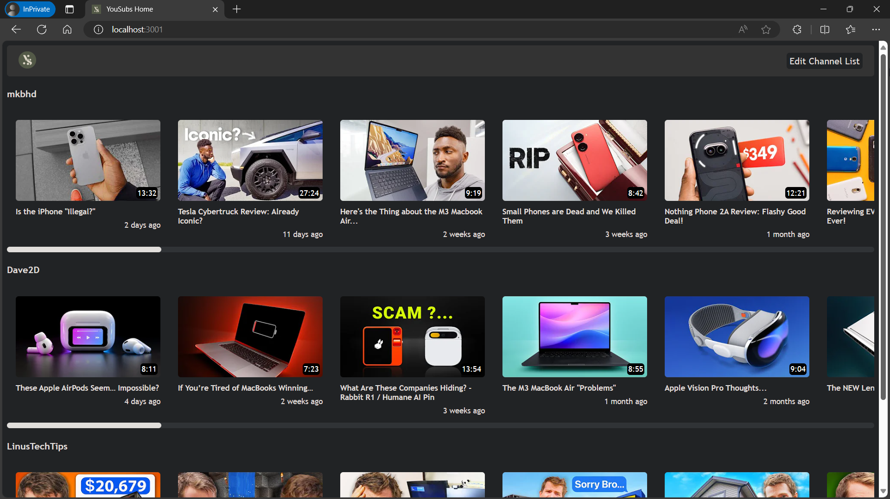
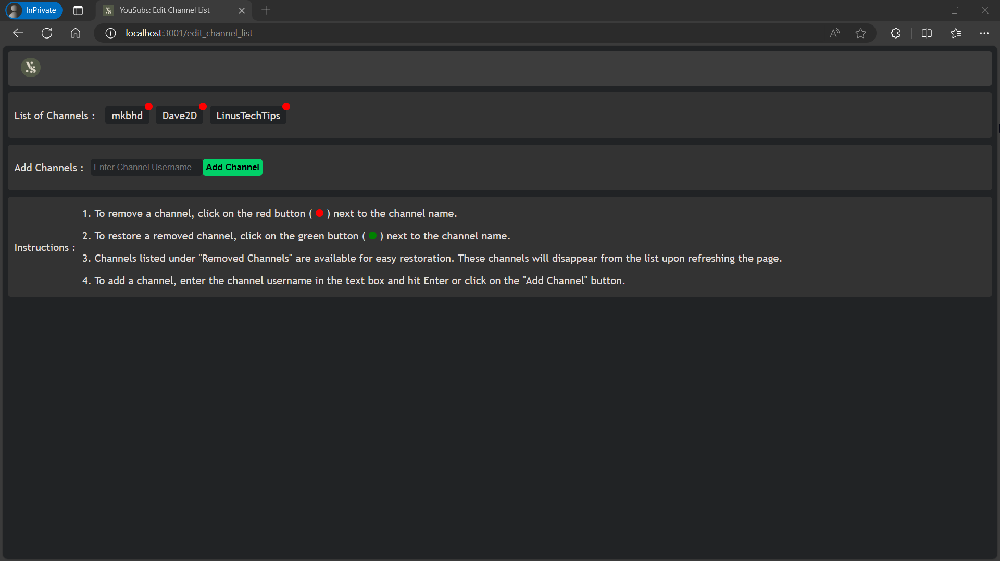
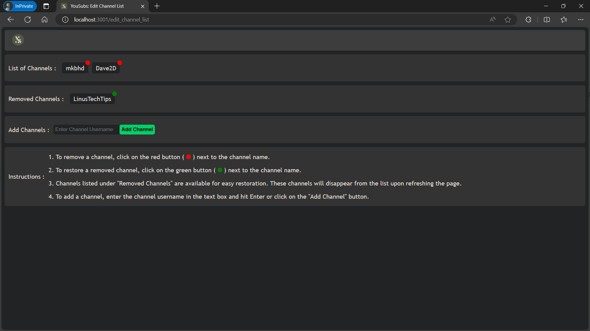
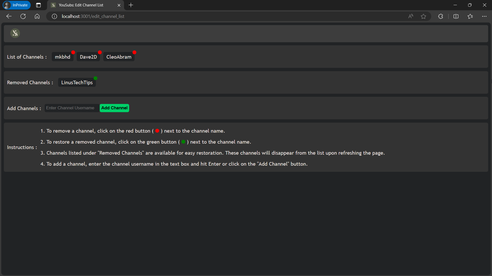
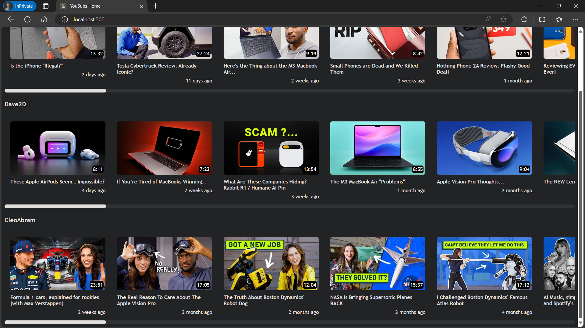

# YouSubs

Welcome to the YouSubs project!

**Motivation:**

In an era where privacy and security are big concerns, YouSubs offers a solution that prioritizes user privacy by providing a secure platform to manage favorite YouTube channels without the need to log in to YouTube or share personal data. By maintaining a private list of channels locally, YouSubs ensures that users can enjoy their favorite content without exposing personal details or data to potential risks, including malware on non-personal devices and security vulnerabilities on public networks.

**Features:**

- Maintain a private list of YouTube channels.
- View the latest videos posted by the channels in the list.
- Add new YouTube channels to the list.
- Remove existing channels from the list.

**How It Works:**

The YouSubs project utilizes Node.js for server-side logic and Express.js for routing. It leverages the File System module in Node.js to read and write data to the `channels.json` file, acting as a simple database for storing channel information. The project provides a web interface accessible through the `/edit_channel_list` endpoint, where users can interact with the channel list, add new channels, and remove existing ones. The latest videos from the channels are accessible through the index endpoint `/`.

**Demo Images:**

**API Integration:**

YouSubs uses the [YouTube V2 API](https://rapidapi.com/omarmhaimdat/api/youtube-v2 "YouTube V2 API on RapidAPI") published by [Omar M&#39;Haimdat](https://rapidapi.com/user/omarmhaimdat "Omar Mhaimdat on RapidAPI") on [RapidAPI](https://rapidapi.com "RapidAPI"). This API allows YouSubs to fetch the latest videos from the added YouTube channels, enhancing the user experience with up-to-date content.

**Get Started:**

1. Clone the repository to your local machine (or) Download the latest release zip.
2. Sign up for a free account on RapidAPI and get an API key for the YouTube V2 API by subscribing to the BASIC (free) plan.
3. Set the `RapidAPI_Key` environment variable to your API key.
4. Run `run.bat` to start the project.
5. Access the YouSubs interface at `http://localhost:3001/edit_channel_list` to manage your channel list.
6. Access the latest videos from your favorite channels at `http://localhost:3001/`.

**Note:**

The application was developed and tested using the API's BASIC (free) plan, which has a 1 request per second limit. To maximize performance with a paid plan, consider adjusting the implemented connection timeouts for API calls.

**Contribution:**
Contributions to the YouSubs project are welcome! Whether you want to add new features, improve existing functionality, or fix bugs, feel free to fork the repository, make your changes, and submit a pull request. Your contributions will help enhance the project and make channel management more private and secure for users.

Thank you for exploring the YouSubs project. Enjoy managing your favorite YouTube channels securely and privately!
